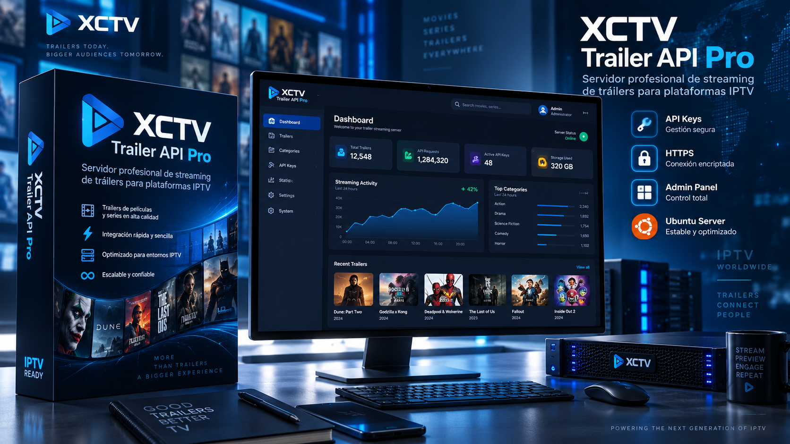

<h1 align="center">XCTV YouTube Trailer API Pro</h1>

 
## 🏁 Getting Started

YouTube API Server Pro is a self-hosted platform for Ubuntu Server that enables the integration and playback of YouTube trailers within IPTV apps, Roku, Android TV, Fire TV, mobile applications, websites, and external players.

The system receives a video ID or URL, retrieves a compatible format, and delivers it via HTTP/HTTPS streaming without storing a permanent copy of the video on the server. It supports Range requests, partial playback, seeking (fast-forward/rewind), and "206 Partial Content" responses.

It includes a modern administrative dashboard for creating clients, managing API keys, setting expiration dates, limiting concurrent streams, blocking accounts, querying requests, monitoring the VPS, and adjusting system settings.

It is designed for IPTV providers, app developers, resellers, rebranding companies, and platforms requiring trailer integration via a private, controlled API. :smile:

## 🖌️ Included Functions

- Direct playback via /watch and /stream.
- Does not permanently store YouTube videos.
- Preference for MP4 format up to 720p.
- HTTP Range support.
- 200 OK and 206 Partial Content responses.
- Supports seeking (fast-forward/rewind) and resuming playback.
- CDN preflight check before stream delivery.
- Internal retries and automatic format switching.
- Temporary caching of validated URLs.
- Single-flight system: processes a single resolution per video even with simultaneous requests from multiple users.
- Trailer preloading via /prefetch.
- Support for authenticated Firefox cookies.
- Private, automatic cookie snapshotting.
- Local PO Token provider.
- JavaScript challenge resolution via Deno.
- Integration with FFmpeg, ffprobe, curl_cffi, and yt-dlp-ejs.
